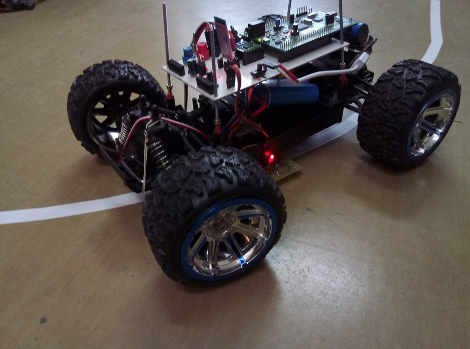
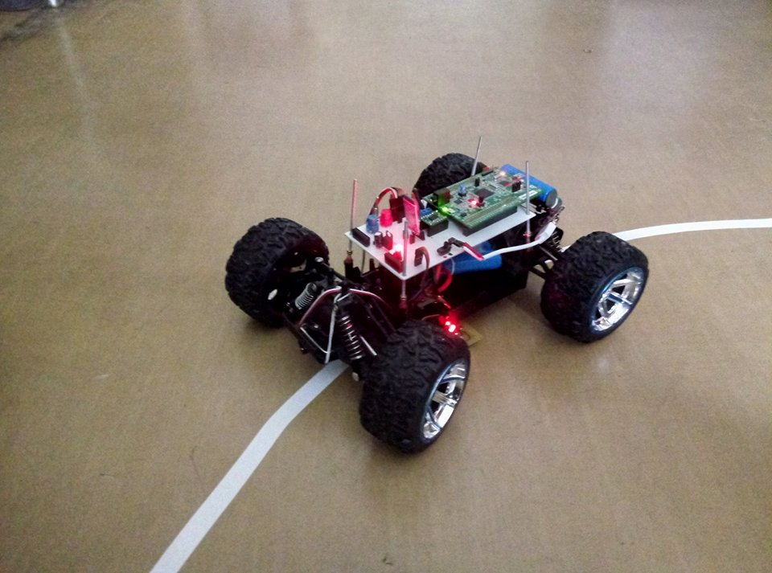

# Praca Dyplomowa (inżynierska)
Tematem pracy była Analiza konstrukcyjna systemu śledzenia linii.

Zaawansowane rozwiązania techniczne pomagają w osiąganiu coraz to lepszych wyników w różnych dyscyplinach sportowych,
towarzyszą podczas treningów zapewniając wsparcie i umożliwiając pokonywanie kolejnych granic oraz realizację założonych celów.
Wspierają one nie tylko zawodowych sportowców, ale również amatorów, ze względu na ich ogólną dostępność. 
Coraz częściej spotkać można bardzo zaawansowane aplikacje i urządzenia, wykorzystywane w sporcie, 
a oferta firm zajmujących się produkcją takiego sprzętu nieustannie się poszerza o nowe rozwiązania.

Celem pracy była realizacja robota, wykorzystującego system śledzenia linii, w celu utrzymywania zadanego tempa biegacza trenującego na bieżni lekkoatletycznej, 
aby osiągnąć większą efektywność treningów. Projekt składa się z dwóch podzespołów. 
Pierwszy z nich jest niesiony przez biegacza, jego zadaniem jest pomiar tętna i utrzymanie go w zakresie ustalonym przez ćwiczącego. 
Drugi moduł ma za zadanie jechać po ustalonej linii i utrzymywać zadane tempo.

https://youtu.be/Zt6rl9LgnUI

Created by https://www.linkedin.com/in/kamil-gradowski-8706991aa - feel free to contact me! grados73
